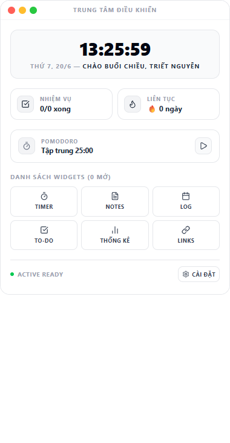
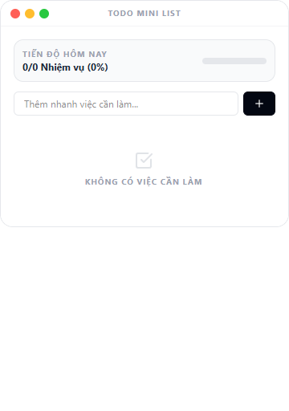
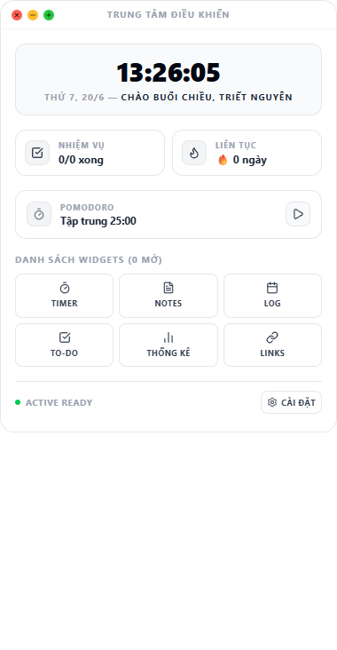
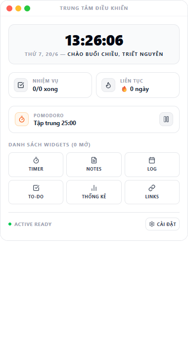

# Trung Tâm Điều Khiển — Productivity Desktop Widget

Widget desktop nhỏ gọn cho Windows, đóng vai trò "trung tâm điều khiển" cho các công cụ năng suất cá nhân: Pomodoro, ghi chú nhanh, nhật ký hoạt động, to-do, phím tắt truy cập web — tất cả gói trong các cửa sổ nổi nhỏ, luôn hiển thị trên cùng.

<p align="center">
  
</p>

## Tính năng

- **MainCard ("Trung tâm điều khiển")** — đồng hồ/lịch, lời chào theo giờ, trạng thái nhiệm vụ, streak, điều khiển Pomodoro nhanh, và bảng điều hướng tới toàn bộ widget.
- **Pomodoro Timer** — đếm ngược tập trung/nghỉ ngơi theo thời lượng tự cấu hình, tự động ghi log khi hoàn thành 1 chu kỳ.
- **Notes (Sticky Notes)** — ghi chú nhanh dạng thẻ màu, tìm kiếm theo tiêu đề/nội dung.
- **Daily Activity Log** — nhật ký hoạt động theo ngày, phân loại Work/Study/Exercise/Life/Other.
- **Todo Mini List** — danh sách việc cần làm gọn nhẹ, đánh dấu hoàn thành/xoá nhanh.
- **Links (Phím tắt truy cập nhanh)** — lưu các đường dẫn web hay dùng, mở bằng browser hệ thống.
- **Quick Stats** — thống kê tổng hợp từ nhật ký hoạt động và streak.
- **Dữ liệu persist thật** qua `electron-store` — toàn bộ task/note/log/shortcut/settings sống sót qua restart, không mất khi tắt app.
- **Đồng bộ realtime giữa các cửa sổ** — sửa dữ liệu ở 1 widget (vd tick task ở Todo) phản ánh ngay trên MainCard, không cần mở lại.
- **Nhớ vị trí cửa sổ MainCard** — kéo MainCard tới vị trí nào, lần mở sau vẫn ở đúng đó (tự kiểm tra nếu đổi màn hình/độ phân giải).
- **Traffic-light controls kiểu macOS** — 3 nút tròn đóng/thu nhỏ/phóng to tự thiết kế, thay cho title bar Windows mặc định.

## Screenshots

<table>
  <tr>
    <td align="center">
      <br/>
      <sub>Todo Mini List</sub>
    </td>
    <td align="center">
      <br/>
      <sub>Traffic-light controls (hover hiện icon)</sub>
    </td>
    <td align="center">
      <br/>
      <sub>Pomodoro đang chạy</sub>
    </td>
  </tr>
</table>

## Tech Stack

- **Electron** + **electron-vite** — main/preload/renderer build pipeline
- **React** + **TypeScript**
- **Tailwind CSS**
- **electron-store** — persistence layer (lưu task/note/log/shortcut/settings/vị trí cửa sổ xuống đĩa)
- **electron-builder** — đóng gói app thành file `.exe`
- **Playwright** (`_electron`) — script tự động chụp screenshot toàn bộ widget cho dev (`scripts/capture-screenshots.ts`)

## Getting Started

**Yêu cầu:** Node.js, Windows.

```bash
git clone <repo-url>
cd productivity-desktop-widget
npm install
npm run dev
```

`npm run dev` chạy app ở chế độ phát triển (electron-vite dev server + hot reload).

## Build file .exe

```bash
npm run build:win
```

Lệnh này chạy `electron-vite build` (build main/preload/renderer) rồi `electron-builder --win portable`, tạo ra một file `.exe` portable duy nhất (không cần installer) tại:

```
dist/productivity desktop widget <version>.exe
```

Icon app đã được gắn sẵn qua `assets/icon.ico` (cấu hình trong `build.win.icon` ở `package.json`), áp dụng cho cả file `.exe` đóng gói và cửa sổ app khi chạy `npm run dev`.

## Project Structure

```
src/
  main/         # Electron main process — quản lý window, IPC, electron-store
  preload/      # contextBridge — expose electronAPI an toàn cho renderer
  renderer/      # React app — MainCard + các widget window riêng biệt
    components/  # UI components dùng chung (MainCard, WindowFrame, từng widget...)
    windows/     # Entry point cho mỗi cửa sổ widget (pomodoro.tsx, quicknote.tsx...)
scripts/
  capture-screenshots.ts   # Script Playwright tự động mở app + chụp screenshot từng widget
assets/
  icon.ico       # Icon app
docs/images/      # Ảnh minh hoạ dùng trong README
```
